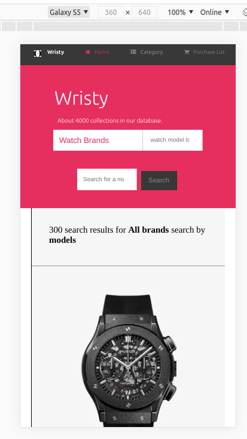

# Capstone-Online-Store

> For the purpose of educational practical exhibition, this capstone project marks the completion of html/css technical curriculum. In this project i created an online store, that deals strictly on designers wrist watches. the name of the ficticious company is wristy.

About Wristy!

Wristy is proposed to be a world renowned tested and trusted leading global jewery wrist watches dealer, only on legacy brands. And of which this website, design and implemented with user experience centered purpose. Is the platform through which they communicate and transact with thier dedicated customers and partners on a daily bases. Round the clock, all day all year. 

Home Page:

The home page is layered from top to bottom in a simplified fashion, each section having two sub-sections. from the header, the upper subsection, contains the companies important links. From left to right, the companies logo and name, a house icon complemented by the word home, a category link that leads to product search and listing page, post and button for our subscribed users. next to the far right is the image notification incon, name and photo of a subscribed user. 

The lower header sub section, at the center is the companies name written in a large font. complemented right under it with companies Sales Mantra! 
then finally a single line form for various wrist watch brands in our stock.

On the main section the upper sub section is the Hot Ads section, a hot section where the latest products in the jeweler industry. while the lower sub section contains the listings of variious product year releases in no particluar order. 

The footer is not an exception on the layered pattern with which this website designed. the upper sub-section contains 4 unit blocks on a row. the first unit contains small written content about wristy with the logo at the top, next unit is categories with listed options, the next is navigation unit with a isted directives on how to navigate the website, the last and important unit contains three important option selectors, Country, Language and Currency. the lower sub section are for copyrights notfication and various social media platform icons.

Category Page:

The header and footer section are the same with the home page.  the slight difference with the header lower subsection is the light font wight of the company name and the details about amount of product collection in the database.

Aside section starting from the top, are the two check boxes with "custom sample" and "brand sample" respectlively. followed by Types option and Brands right under it. The last on the aside section id the Price Range option.

The main section showing the search results of some entries made. 

Responsiveness:

In order to make sure that wristy is user friendly, i made it responsive to enable cross-platform consumer convenience. Hence, Irrespective of the type of device you are using. it sits beautifuly with your screen size.

NA: in order to feed my curiosity and exercise what i have learnt, i opted to work on this project without any framework. only raw CSS.

Home Page

Search Result Page

## Built With
- flexbox
- Grid
- html & css,
- Visual Studio Code, Git and Github.

## Live Demo
[Live Demo Link](https://rawcdn.githack.com/digitekh2i/Capstone-Online-shop/048b58163d333598a58ffa980bbab0328958e176/index.html)

## Authors

👤 **Author1**

- Github: [@digitekh2i](https://https://github.com/digitekh2i)
- Twitter: [@ObokoDaniel](https://twitter.com/ObokoDaniel)
- Linkedin: [linkedin](http://linkedin.com/in/daniel-dikachi-1luvtek101)

## 🤝 Credits
- Hublot
- Bulgari
- Rolex
- Omega
- Cartier 

## 🤝 Contributing

Contributions, issues and feature requests are welcome!

Feel free to check the [issues page](issues/).

## Show your support

Give a ⭐️ if you like this project!

## Acknowledgments

- Hat tip to anyone whose code was used
- Inspiration
- etc

## 📝 License

This project is [MIT](lic.url) licensed.
