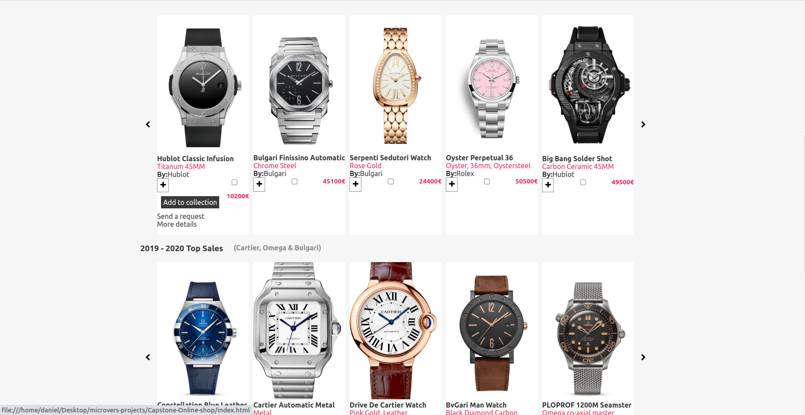
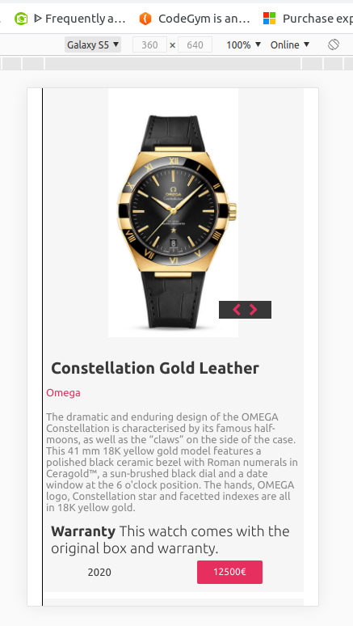

# Capstone-Online-Store

> For the purpose of educational practical exhibition, this capstone project marks the completion of html/css technical curriculum. In this project i created an online store, that deals strictly on designers wrist watches. the name of the ficticious company is wristy.

About Wristy!

Wristy is proposed to be a world renowned tested and trusted leading global jewery wrist watches dealer, only on legacy brands. And of which this website, design and implemented with user experience centered purpose. Is the platform through which they communicate and transact with thier dedicated customers and partners on a daily bases. Round the clock, all day all year. 

NA: in order to feed my curiosity and excercise what i have learnt, i opted to work on this project without any framework. only raw CSS.

Home Page

Search Result Page

## Built With
- flexbox
- Grid
- html & css,
- Visual Studio Code, Git and Github.

## Live Demo
[Live Demo Link](https://raw.githack.com/digitekh2i/Capstone-Online-shop/dev-ground/index.html)

## Authors

👤 **Author1**

- Github: [@digitekh2i](https://https://github.com/digitekh2i)
- Twitter: [@ObokoDaniel](https://twitter.com/ObokoDaniel)
- Linkedin: [linkedin](http://linkedin.com/in/daniel-dikachi-1luvtek101)

## 🤝 Credits
- Hublot
- Bulgari
- Rolex
- Omega
- Cartier 

## 🤝 Contributing

Contributions, issues and feature requests are welcome!

Feel free to check the [issues page](issues/).

## Show your support

Give a ⭐️ if you like this project!

## Acknowledgments

- Hat tip to anyone whose code was used
- Inspiration
- etc

## 📝 License

This project is [MIT](lic.url) licensed.
